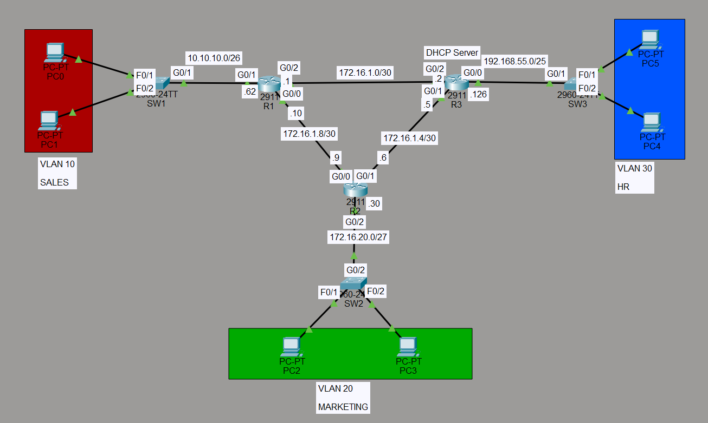
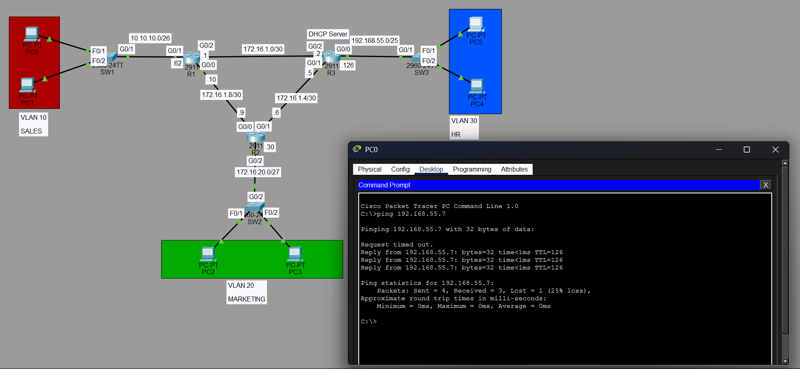
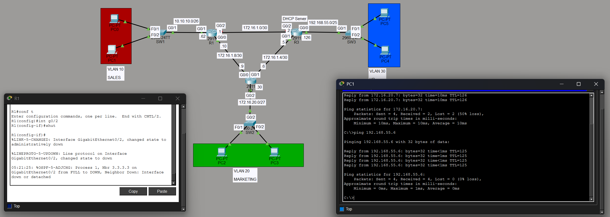

# OSPF Redundant Core with VLAN Segmentation and DHCP

## Objective
Demonstrates OSPF single-area (Area 0) routing across a three-router 
redundant core, integrated with VLAN segmentation for three business 
units (Sales, Marketing, HR), dynamic addressing via DHCP, and VLSM-based 
subnet design. The topology also demonstrates OSPF's automatic failover 
behavior when a link fails.

## Topology

- **R1, R2, R3** form a fully-meshed OSPF core (Area 0), providing 
  redundant paths between all three edge networks
- **SW1 (SALES / VLAN 10)** — 10.10.10.0/26
- **SW2 (MARKETING / VLAN 20)** — 172.16.20.0/27
- **SW3 (HR / VLAN 30)** — 192.168.55.0/25
- Router-to-router links use /30 point-to-point subnets

## Design Decisions
- Point-to-point router links were originally designed as /31 subnets 
  per RFC 3021 to conserve address space. Packet Tracer's IOS simulation 
  does not support /31 addressing, so /30s were used instead.
- Subnet sizes were chosen via VLSM to match each department's host 
  count rather than using a uniform /24 across the board.
- Each edge switch carries a single VLAN (access ports only); no 
  trunking is required in this topology since each department has its 
  own dedicated switch and router-facing subnet.

## Configuration Overview
- OSPF process 1 enabled on all three routers, all interfaces 
  advertised into Area 0
- Router IDs manually assigned (1.1.1.1, 2.2.2.2, 3.3.3.3)
- LAN-facing interfaces set as passive to suppress unnecessary OSPF 
  hellos on non-transit segments
- DHCP configured on R3 with three pools (one per subnet), each with 
  excluded address ranges reserved for gateways and infrastructure
- `ip helper-address` configured on R1 and R2's LAN-facing interfaces 
  to relay DHCP broadcasts to R3 across subnet boundaries

## Verification

**OSPF adjacencies (R2):**
Neighbor ID     Pri   State           Dead Time   Address         Interface
1.1.1.1           1   FULL/BDR        00:00:33    172.16.1.10     GigabitEthernet0/0
3.3.3.3           1   FULL/BDR        00:00:32    172.16.1.5      GigabitEthernet0/1
Full adjacencies confirmed with both neighboring routers.

**Routing table (R1) — note equal-cost multi-path:**
O    172.16.1.4 [110/2] via 172.16.1.2, GigabitEthernet0/2
[110/2] via 172.16.1.9, GigabitEthernet0/0
O    172.16.20.0 [110/2] via 172.16.1.9, GigabitEthernet0/0
O    192.168.55.0 [110/2] via 172.16.1.2, GigabitEthernet0/2
R1 shows ECMP routing to 172.16.1.4/30 via both R2 and R3, demonstrating 
OSPF actively load-balancing across the redundant core rather than only 
using a backup path during failure.

**DHCP bindings (R3) — all six hosts leased successfully:**
10.10.10.6    172.16.20.6    192.168.55.6
10.10.10.7    172.16.20.7    192.168.55.7
All three VLANs successfully obtained addresses via DHCP relay.

**End-to-end connectivity:** PC0 (SALES) successfully pinged PC5 (HR) 
across the full OSPF core.

## Failover Demonstration
The R1–R3 direct link (172.16.1.0/30) was administratively shut down 
to simulate a link failure:
%LINK-5-CHANGED: Interface GigabitEthernet0/2, changed state to administratively down
%OSPF-5-ADJCHG: Process 1, Nbr 3.3.3.3 on GigabitEthernet0/2 from FULL to DOWN
During reconvergence, a ping from PC0 to PC5 showed, despite the interface being disabled, the network 
stabilized with full connectivity restored via the R1–R2–R3 path. This 
confirms the redundant topology provides automatic failover without 
manual intervention.

## Troubleshooting Notes
Initial DHCP failures were traced to the switch-to-router uplink port 
not being assigned to the correct VLAN, which prevented DHCP broadcasts 
from reaching the router interface. Correcting the uplink's VLAN 
membership resolved the issue across all three subnets.

## Known Limitations / What I'd Add Next
- No OSPF authentication configured — would add for production security
- DHCP runs on a single router with no backup — a real deployment 
  would need redundancy here
- This lab focuses on IPv4; IPv6 dual-stack was not implemented
