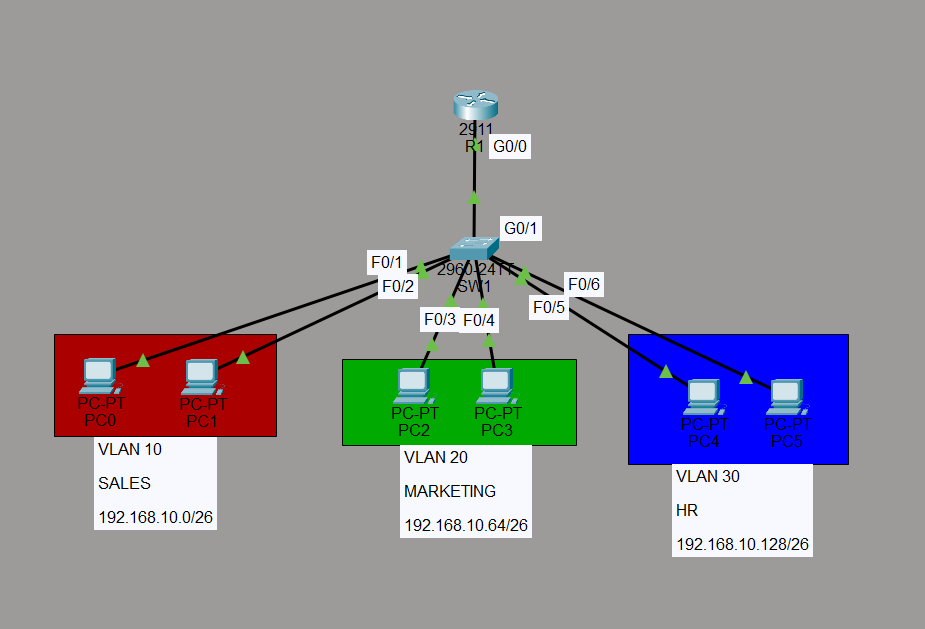
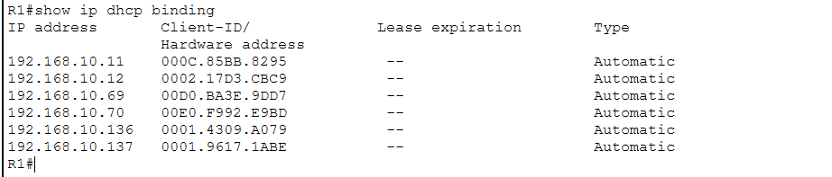
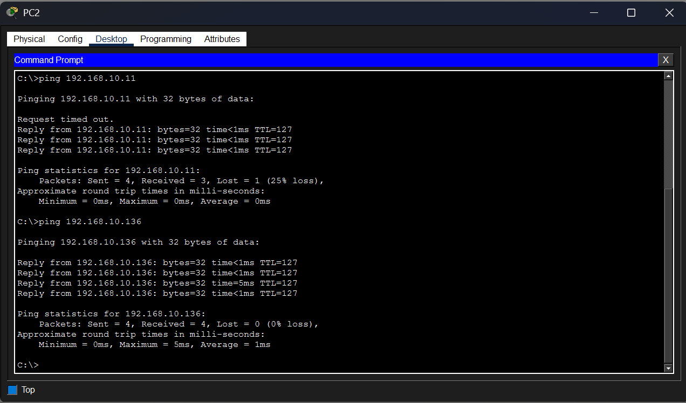

# Router-on-a-Stick with VLAN Segmentation and Access Control

## Objective
Demonstrates inter-VLAN routing using router-on-a-stick (subinterfaces 
with 802.1Q trunking) across three departments, with DHCP for dynamic 
addressing, port security to protect access-layer ports, and an 
extended ACL enforcing a business security requirement between 
departments.

## Topology


- **R1**: single physical interface (G0/0) as an 802.1Q trunk, with 
  subinterfaces acting as the gateway for each VLAN
- **SW1**: access switch with three VLANs, trunked to R1
- **VLAN 10 (Sales)**: 192.168.10.0/26
- **VLAN 20 (Marketing)**: 192.168.10.64/26
- **VLAN 30 (HR)**: 192.168.10.128/26

## Design Decisions
- A single /24 was subnetted via VLSM into three /26 blocks rather 
  than using separate /24s per department, reflecting a more realistic 
  allocation from a single assigned address block.
- Router-on-a-stick was chosen specifically to demonstrate subinterface 
  and 802.1Q trunking configuration. In a larger production network, a 
  Layer 3 switch would typically handle inter-VLAN routing instead, but 
  ROAS remains common in smaller deployments and is a foundational 
  concept worth demonstrating on its own.
- Business security requirement: Sales and HR should not be able to 
  communicate directly, while Marketing requires access to both. This 
  reflects a realistic scenario where HR data is restricted from 
  unrelated departments.

## Configuration Overview
- Physical interface G0/0 has no IP address; it only requires 
  `no shutdown` to pass tagged trunk traffic
- Subinterfaces (G0/0.10, G0/0.20, G0/0.30) each configured with 
  `encapsulation dot1q [VLAN]` and act as the gateway for their subnet
- DHCP pools configured directly on R1 (one per VLAN), each with 
  excluded address ranges reserved for gateways and static devices
- Extended named ACL (`TRAFFIC-RULES`) denies traffic between the 
  Sales and HR subnets, applied inbound on G0/0.10 (closest to the 
  source, per extended ACL best practice)
- Port security configured on all access ports via `interface range`, 
  limiting each port to 2 MAC addresses learned via sticky, with 
  violations set to `restrict` (logs and counts the violation while 
  keeping the port operational)

## Verification

**DHCP configuration (R1):**
```
ip dhcp pool SALES
 network 192.168.10.0 255.255.255.192
 default-router 192.168.10.1

ip dhcp pool MARKETING
 network 192.168.10.64 255.255.255.192
 default-router 192.168.10.65

ip dhcp pool HR
 network 192.168.10.128 255.255.255.192
 default-router 192.168.10.129
```
All six PCs successfully leased addresses matching their VLAN's subnet.



**Access control list (R1):**
```
Extended IP access list TRAFFIC-RULES
    10 deny ip 192.168.10.0 0.0.0.63 192.168.10.128 0.0.0.63
    20 permit ip any any
```
Applied inbound on G0/0.10.

**Port security (SW1):**
```
Secure Port  MaxSecureAddr  CurrentAddr  SecurityViolation  Security Action
Fa0/1        2              1            0                  Restrict
Fa0/2        2              1            0                  Restrict
Fa0/3        2              1            0                  Restrict
Fa0/4        2              1            0                  Restrict
Fa0/5        2              1            0                  Restrict
Fa0/6        2              1            0                  Restrict
```
Sticky MAC addresses confirmed learned and bound to their respective 
VLANs and ports.

## Connectivity Matrix
| From      | To        | Result       |
|-----------|-----------|--------------|
| Sales     | Marketing | ✅ Success   |
| Marketing | HR        | ✅ Success   |
| Sales     | HR        | ❌ Blocked   |
| HR        | Sales     | ❌ Blocked   |



## Security Enforcement Detail
Testing revealed the ACL blocks traffic in both directions despite only 
explicitly denying one direction (Sales → HR):

- **Sales → HR:** Immediately rejected by R1 with "Destination host 
  unreachable," confirming the deny rule matched on ingress at G0/0.10.
- **HR → Sales:** Requests timed out rather than being actively 
  rejected. The initial ICMP echo from HR was not blocked (it did not 
  match the source/destination pair in the ACL), but the reply from 
  Sales, matching the denied source/destination pair, was blocked on 
  its way back through G0/0.10. This demonstrates that a single deny 
  rule on the return path is sufficient to block a bidirectional 
  conversation such as ICMP.

## Troubleshooting Notes
Port security initially showed zero learned addresses (`CurrentAddr: 0`) 
despite correct configuration. This was resolved by generating traffic 
from each PC, sticky MAC learning only populates once a frame is 
actually received on the port, not at the moment the configuration is 
applied.

## Known Limitations / What I'd Add Next
- The ACL only addresses one directional pair (Sales/HR); a larger 
  network with more departments would need a more scalable approach, 
  such as VLAN-based ACL application or zone-based policies
- No logging was configured on the ACL itself to record denied attempts 
  over time
- DHCP runs on a single router with no backup or failover configured
