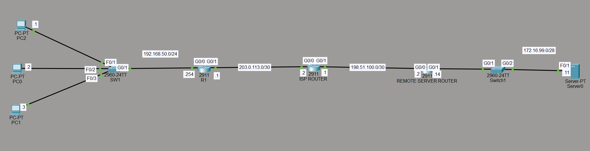
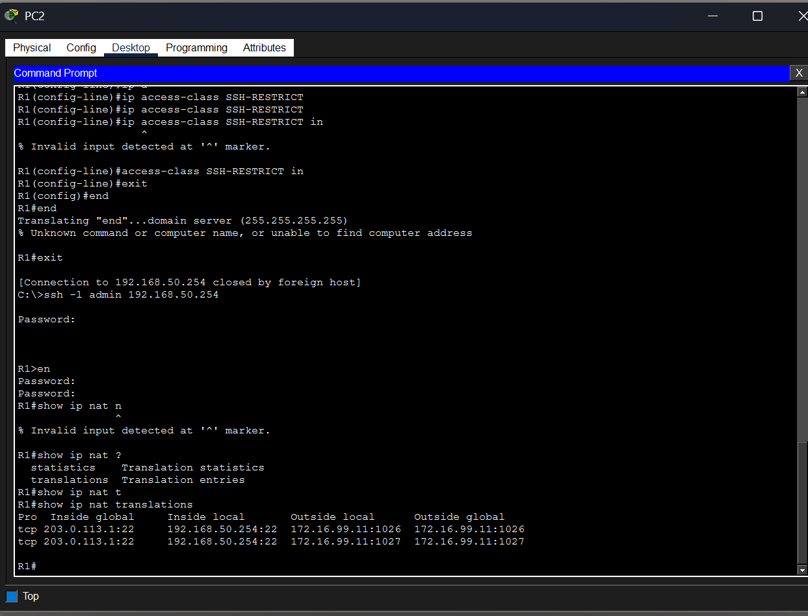
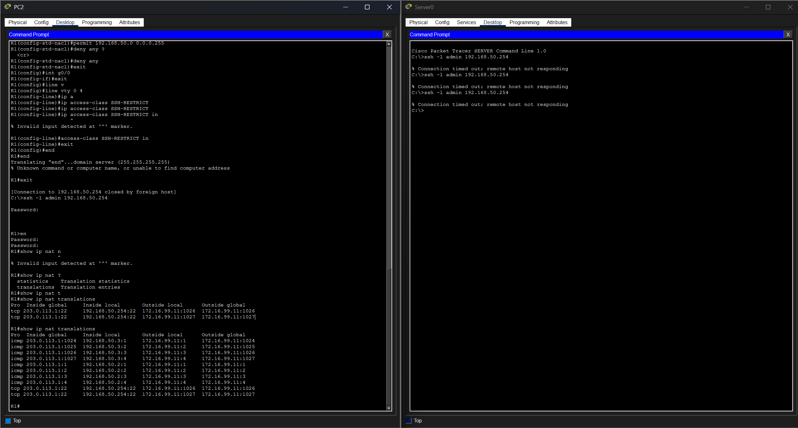

# NAT Overload with Secured Remote Management (SSH)

## Objective
Demonstrates a small office network connecting to an external network 
through NAT overload (PAT), simulating internet-style connectivity via 
an intermediate ISP router. Also demonstrates secured remote management 
of the edge router using SSH, with access restricted to internal hosts 
only via an ACL applied to the VTY lines.

## Topology


- **Internal LAN** — 192.168.50.0/24 (PC0, PC1, PC2) behind R1
- **R1** — edge router, performs NAT overload for the internal network
- **ISP Router** — simulates internet transit, no NAT of its own
- **Remote Server Router** — edge router for a separate network hosting 
  Server0 (172.16.99.0/28)
- WAN transit links use RFC 5737 documentation address space 
  (203.0.113.0/30 and 198.51.100.0/30) rather than real public ranges

## Design Decisions
- Documentation address ranges (203.0.113.0/24, 198.51.100.0/24) were 
  used for WAN-facing links instead of arbitrary IPs, since these 
  ranges are specifically reserved for lab/documentation use per RFC 
  5737 and avoid any resemblance to real, routable public addresses.
- Static routing was used between the three routers rather than a 
  dynamic protocol, reflecting a realistic small-edge-network design 
  where a simple default route to the ISP is more appropriate than 
  running OSPF or BGP for a single-homed connection.
- SSH was chosen over Telnet exclusively (`transport input ssh`) since 
  Telnet transmits credentials in plaintext and has no place in a 
  security-conscious configuration.

## Configuration Overview
- Interface roles confirmed via `show cdp neighbors` before configuring 
  NAT, after an initial mix-up assuming interface roles from the 
  topology diagram alone
- G0/0 (LAN-facing) set as `ip nat inside`; G0/1 (ISP-facing) set as 
  `ip nat outside`
- Standard ACL identifying the internal network, referenced in the NAT 
  overload statement (`ip nat inside source list [ACL] interface g0/1 
  overload`)
- SSH prerequisites configured in order: hostname, domain name, RSA key 
  pair (crypto key generate rsa), local username/secret, enable secret
- VTY lines restricted to `transport input ssh` (Telnet disabled) and 
  `login local`
- Separate standard ACL (`SSH-RESTRICT`) permitting only 
  192.168.50.0/24, applied to the VTY lines via `access-class ... in`

## Verification

**NAT translations (R1) — two internal hosts sharing one outside address:**
```
Pro   Inside global      Inside local       Outside local    Outside global
icmp  203.0.113.1:1024   192.168.50.3:1     172.16.99.11:1   172.16.99.11:1024
icmp  203.0.113.1:1      192.168.50.2:1     172.16.99.11:1   172.16.99.11:1
```
Multiple internal hosts (192.168.50.2 and 192.168.50.3) successfully 
translated to the single outside address 203.0.113.1, distinguished by 
port number — confirming PAT/NAT overload is functioning correctly.



**SSH access — restricted successfully:**

From an internal PC (192.168.50.x):
```
C:\>ssh -l admin 192.168.50.254
Password: 
R1>en
Password:
R1#
```
Successful authentication and privilege escalation.

From Server0 (outside the permitted network):
```
C:\>ssh -l admin 192.168.50.254
% Connection timed out; remote host not responding
```
Repeated connection attempts consistently blocked by the SSH-RESTRICT 
ACL, confirming only internal hosts can reach R1's management plane.



**Routing table (R1):**
```
Gateway of last resort is 203.0.113.2 to network 0.0.0.0
S    172.16.99.0/28 [1/0] via 203.0.113.2
S    198.51.100.0/30 [1/0] via 203.0.113.2
S*   0.0.0.0/0 [1/0] via 203.0.113.2
```
Confirms static routing correctly directs all non-local traffic toward 
the ISP.

## Troubleshooting Notes
- Initially misread the topology diagram and assumed the wrong 
  interfaces for NAT inside/outside. Resolved by running 
  `show cdp neighbors` on R1 to confirm the actual physical connections 
  (G0/0 to the internal switch, G0/1 to the ISP router) rather than 
  relying on the diagram alone.
- Attempted `ip access-class` on the VTY lines, which is invalid syntax 
  — the correct command is `access-class` without the `ip` prefix. This 
  is distinct from `ip access-group`, which is used on physical 
  interfaces rather than VTY lines.
- SSH login initially failed to reach privileged mode due to no enable 
  secret being configured; resolved by setting one directly on the 
  router console before reconnecting via SSH.

## Known Limitations / What I'd Add Next
- Only ICMP and SSH traffic were tested through NAT; a production 
  verification would also confirm HTTP/HTTPS or other application 
  traffic translates correctly
- No NAT translation timeout tuning was performed; default timers 
  were left in place
- SSH authentication uses a single local username; a production 
  deployment would integrate with a centralized AAA server (RADIUS or 
  TACACS+) rather than local-only authentication
